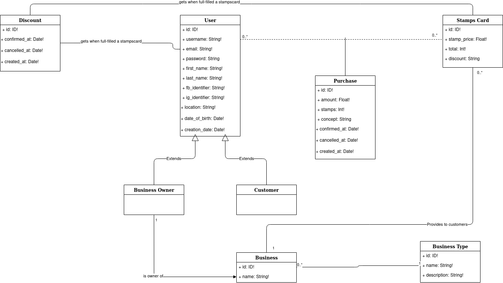

# Stamps Card API

## Description

- GraphQL server that provides the data for the Stamps Card app.
- Please, be careful when you upgrade package versions from GraphQL Yoga and Prisma.
- Those are the different components of this API:

1.  **GraphQL Yoga Server:** responsible of connecting with the client (in our case will be an Android phone or iOS phone) and server the queries/mutations based on the GraphQL schema.

2.  **Prisma server**: this server is an intermediate between the database and the GraphQL Yoga Server. Maps the database schema into a GraphQL schema that can be accessed performing GraphQL queries and mutations using the [Prisma Client](https://www.prisma.io/docs/prisma-client/).

3.  **Database**: MySQL database that persist the information and is mapped to the Prisma endpoint.

  


## Domain model



## Technology Stack

Based on a [Prisma boilerplate](https://github.com/graphql-boilerplates/node-graphql-server/tree/master/basic) provided by the organization itself to build a GraphQL server using GraphQL Yoga and ES6.

- Build with **NodeJS** using a [IOC container](https://github.com/jaredhanson/electrolyte).

-  [GraphQL Yoga]([https://github.com/prisma-labs/graphql-yoga](https://github.com/prisma-labs/graphql-yoga)) server that runs a Express JS Server based on a GraphQL schema located in `src/schema.graphql`

- We use [Prisma]([https://www.prisma.io/](https://www.prisma.io/)) as an ORM for our database. The schema is defined in `database/datamodel.prisma`.

-  **Docker** to build up an environment with the database and the Prisma API that connects with the GrpahQL Yoga server and maps the entities.

-  [Now]([https://zeit.co/docs](https://zeit.co/docs)) for deployments.

-  **Amazon EC2** to host the persistence systema (Prisma API).

  

## Set up

- The current version for Prisma is `1.34`. They actually have a nice documentation that you can review if you need to check something: [https://www.prisma.io/docs/get-started/01-setting-up-prisma-new-database-JAVASCRIPT-a002/](https://www.prisma.io/docs/get-started/01-setting-up-prisma-new-database-JAVASCRIPT-a002/)

- We are using the **MySQL** database driver for the moment.

- You need **Docker** and **Docker Compose** to be able to create, destroy and run the migrations in the database.

> Tip: take a look into `scripts/database.sh`, `scripts/docker.sh` and `run_server.sh` to know about some useful commands to perform the set up operations.

### Set up your environment file

There are multiple environment files now in the repository to represent the different environments that we have so far. I suggest to use the following configuration for your local:

```

API_ENDPOINT="http://localhost:4000"
APP_SECRET="eyJhbGciOiJIUzI1NiIsInR5cCI6IkpXVCJ9"
PRISMA_ENDPOINT="http://localhost:4466/stamps-card-api/dev"
PRISMA_MANAGEMENT_SECRET="qcukf2LfYfPLaQfGFV3KTyhyGagVRpzz"
DEBUG=true
DB_USER=root
DB_PASSWORD=prisma
```

**Important**: you need to copy the `.env` file in the root of the project and inside the database folder.
  

### Database with Prisma

  

With Prisma you can easily create and delete databases using Docker. If you go into the `database` directory, you will see multiple `docker-compose` versions

1.  `docker-compose-machine` is used to deploy the Prisma database in the AWS server.

2.  `docker-compose` is the current version that is going to be executed.

3.  `docker-compose-template` is used if we want to create a new configuration for another environment.

  

To set up the database, we need to access into the `database` directory and run

```

$ docker-compose up -d

```

If everything works as expected 2 new containers would be running now in your machine: `database_prisma_1` and `mysql-db_1`.

  

**How to connect to the Prisma database**

- If you go to http://localhost:4466 you should see a **GraphQL Playground**. This endpoint will be used for the Prisma Client that serves the data in our own GraphQL server (see architecture document).

- In the URL [http://localhost:4466/management](http://localhost:4466/management) you can see the meta data information about the migrations, schema, driver...

- In the URL [http://localhost:4466/_admin](http://localhost:4466/_admin) you can access to a dashboard to manage the database using a UI administration panel. If an error pops up about the token:

	 - Access to the URL mentioned above and go to settings (top right).
	 - We need to set the secret token.
	 - That's the JWT token generated running 'prisma token' in the console.


If you run into some troubles, I suggest you to run `docker logs <container_name_or_id>` to see the errors in the respective container.

> Keep in mind that the database will listen the port `3306`, which is the default port of MySQL. Means that if you have a MySQL local server already running, you should stop it or create another version of docker-compose without uploading it to Git.

### Running the server

1. Install the dependencies.

```$bash

$ yarn install

```

2. Run the server

```$bash

yarn start

```

  

3. Access to http://localhost:4000 and you should see a **GraphQL Playground** which includes all the queries defined in the `src/schema.graphql` and the prisma entities.

  

Please use [Yarn](https://yarnpkg.com/lang/en/) instead of Npm to install your dependencies

  

## Deployments

To perform the deployment we need to run the migrations to the database first and finally deploy the API changes to the API server.

### 1. Deploy the Prisma database

In Prisma `1.34` they changed the way to deploy the database, so needs to be investigated how we can do it.

  

### 2. Deploy the GraphQL server

- We are using [ZEIT](https://zeit.co/dashboard) to deploy this API. The deployments can easily being done using [Now CLI](https://zeit.co/download).

- There is a configuration file called `now.json` which contains all the configuration ready to deploy the server.

- There is a file called `.nowignore`which contains the files and folders that are going to be excluded when we perform the deployment.

- To run the deployment you should run into the root directory `now --dotenv .env.prod` .

  

## Next steps

### Infrastructure
- Migrate to Prisma 2.0
- Migrate to ZEIT 2.0 to perform deployments.

### Product features
- Implement discounts in the system. Those are generated when the users has completely filled a stamps card.
- Support adding/deleting users.
- Support login with social media.

## License
This project is covered by the [Apache License](https://opensource.org/licenses/Apache-2.0).